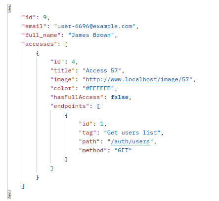
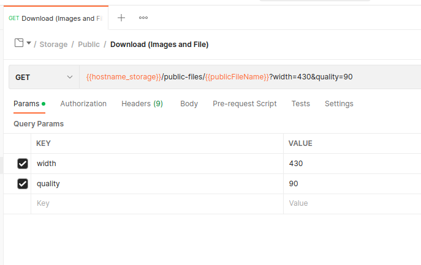
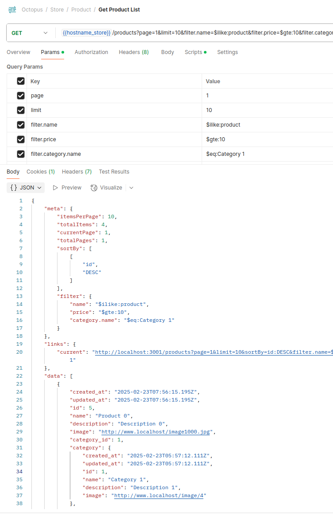

# Octopus GraphQL


## Did you know?

An **octopus** has three hearts! One heart circulates blood around the body, while the other two pump it past the gills, to pick up oxygen.

## About

**Octopus** is a scalable microservices template built with **NestJS**, **RabbitMQ**, **PostgreSQL**, and **Redis**. It provides an efficient and developer-friendly foundation for building distributed systems, supporting both Docker and Kubernetes deployments. The system now leverages **Minio** for object storage, offering a reliable and scalable solution for handling files across services.

## GragphQL:

## Getting Started

```bash
git clone https://github.com/MahdadGhasemian/octopus.git

cd octopus
pnpm i
docker-compose up --build # For the first add the --build
```

## Web UI Tools

Note: The following ports **(8087, 15679 and 5549)** are defined in the `docker-compose` file.

### PgAdmin

- URL: [http://localhost:8087/](http://localhost:8087/)
- Authentication:

```yaml
username: test@test.com
password: randompassword2
connection:
  host-name_address: postgres
  port: 5432
  username: postgres
  password: randompassword
```

### Rabbitmq UI

- URL: [http://localhost:15679/](http://localhost:15679/)
- Authentication:

```yaml
username: user
password: randompassword
```

### Redis UI

- URL: [http://localhost:5549/](http://localhost:5549/)
- Authentication:

```yaml
username: user
password: randompassword
connection:
  host: redis
  port: 6379
  username: none
  password: none
```

### Minio

- URL: [http://localhost:9101/](http://localhost:9101/)
- Authentication:
  Note: connect to minio on port 9101 and create an Access Key

```yaml
username: admin
password: randompassword
```

```bash
mcli alias set octopus http://localhost:9100 admin randompassword
```

## Services

### Auth



- Support dynamic access (role)
- Support auto Caching

### Storage



- Based on MinIO (S3 Object Storage)
- Support multiple file formats:
  - Images: jpg, jpeg, png, bmp, tiff, gif, webp
  - Documents: doc, docx, xlsx, pdf, txt, rtf
  - Media: mp3, wav, mp4, avi, avi, mkv
  - Compressed: zip, rar, tar, 7z, gz
- Support public and private files
- Support resizing and changing the quality of images on download routes
- Support caching on the download routes
- Unique route to upload all files
- Unique route to download all files (if the file is an image type, the system will automatically consider caching and editing utitlies for the file)

### Store



- Support fully Pagination
- Support auto Caching

## Swaggers

- Auth Service: [http://localhost:3000/docs#/](http://localhost:3000/docs#/)
- Store Service: [http://localhost:3001/docs#/](http://localhost:3001/docs#/)
- Storage Service: [http://localhost:3002/docs#/](http://localhost:3002/docs#/)

## Postman GraphQL API

You can access the API collection in our [Postman Public Workspace](https://www.postman.com/dark-crescent-229322/octopus-graphql/overview).

## Migration

There is possible to generate and run migration files on different branches separetly (developing, stage, production)

1. Create environment files - .env.migration.developing - .env.migration.stage - .env.migration.production
   example:

```
POSTGRES_HOST=localhost
POSTGRES_PORT=5436
POSTGRES_USERNAME=postgres
POSTGRES_PASSWORD=randompassword
# POSTGRES_SYNCHRONIZE=true
POSTGRES_SYNCHRONIZE=false
POSTGRES_AUTO_LOAD_ENTITIES=true
```

2. Edit the 'POSTGRES_ENTITIES' parameter inside the package.json file according to your entities
3. Generate and run the migratinos

```bash
# Developing
pnpm run migration:generate:developing
pnpm run migration:run:developing

# Stage
pnpm run migration:generate:stage
pnpm run migration:run:stage

# Production
pnpm run migration:generate:production
pnpm run migration:run:production
```

## Cache Manager

1. Only GET endpoints are cached.
2. Use `@NoCache()` decorator to bypass the caching system for specific endpoints.
3. Use `@GeneralCache()` decorator to cache the endpoint without including the user's token in the cache key.
4. Services caching status:

| Service Name | Module     | Cache Status | Decorator       | Note                                 |
| ------------ | ---------- | ------------ | --------------- | ------------------------------------ |
| Auth         | auth       | not cached   | @NoCache()      |                                      |
| Auth         | users      | cached       |                 | are cached according to user's token |
| Auth         | accesses   | cached       |                 | are cached according to user's token |
| Store        | categories | cached       | @GeneralCache() |                                      |
| Store        | products   | cached       | @GeneralCache() |                                      |
| Store        | orders     | not cached   | @NoCache()      |                                      |
| Store        | payments   | not cached   | @NoCache()      |                                      |
| Storage      |            | not cached   |                 |                                      |

## 🧪 Run Tests

### ✅ Unit Tests

Run unit tests:

```bash
pnpm run test
```

### 🔄 End-to-End (E2E) Tests

1️⃣ Start required services (database, Redis, etc.) in Terminal 1:

```bash
docker-compose -f ./docker-compose-test.yaml up
```

2️⃣ Run E2E tests in Terminal 2:

```bash
pnpm run test:e2e
```

## TODO

- [x] REST To Graphql
- [ ] Document
  - [ ] Githab Readme
  - [x] Postman Graphql
  - [x] Auto generated swagger (only for storage download api)
- [ ] Validations and Transforms
- [ ] Checking cache system
- [ ] Test

## Contributing

Contributions are welcome!

## License

This project is licensed under the MIT License.

## Change log

### 0.0.1 (2025-03-18)

- Converted REST API to support GraphQL.
